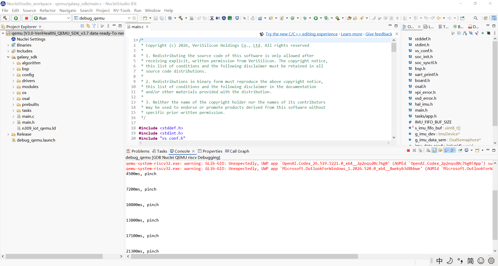

# VeriHealthi QEMU 手势识别算法

基于 VeriHealthi SDK 在 QEMU 仿真平台上的手势识别算法，使用 1D-CNN 模型对 IMU（加速度计 + 陀螺仪）数据进行实时手势分类，支持握拳（clench）、双指互点（pinch）、抬腕（up）、放下（down）四种手势。

---

## 运行截图

> 截图 ：Nuclei Studio输出截图




---

## 项目结构

```
galaxy_sdk/
├── main.c                          # 入口：IMU 初始化、中断使能、任务创建
├── main.h                          # 全局变量与 ISR 声明
├── tasks/
│   ├── app.c                       # imu_task + algo_task 实现
│   └── app.h                       # 事件定义与任务声明
├── algorithm/
│   ├── gesture_algorithm.c         # 1D-CNN 模型 + 后处理
│   └── gesture_algorithm.h         # 数据结构、手势枚举、API
├── bsp/                            # 板级支持包（QEMU 模拟板卡）
├── drivers/                        # IMU 驱动（含预录数据模拟器）
├── osal/                           # 操作系统抽象层（信号量、事件队列、任务）
└── config/                         # SDK 配置文件
qemu/
└── Release/                        # 构建输出
```

---

## 系统架构

### 任务划分

| 任务 | 优先级 | 栈大小 | 职责 |
|------|--------|--------|------|
| `task_init_app` | 1 | 512 words | 板级初始化、IMU 配置、创建子任务后自销毁 |
| `imu_task` | 4 | 1024 words | 中断驱动采集 IMU 数据，填充环形缓冲区，发送事件 |
| `algo_task` | 5 | 2048 words | 等待事件，运行 1D-CNN 推理，回调输出结果 |

### 数据流

```
IMU 模拟器 (50Hz FIFO)
    │
    ▼  FIFO Watermark 中断
imu_data_ready_isr()
    │  osal_sem_post_isr()
    ▼
imu_task
    │  hal_imu_read_gyro_accel()
    │  填充 ring_buffer[50]
    │  CRC-8/SMBus 计算
    │  每 15 帧发送 EVENT_ALGO_PROCESS
    ▼
algo_task
    │  gesture_algorithm_process(ring_buffer)
    │  1D-CNN 推理 → Softmax → 后处理
    ▼
gesture_result_callback()
    │  uart_printf("时间, 手势")
    ▼
串口输出
```

### IMU 初始化流程

1. `hal_imu_get_device()` — 获取 IMU 设备句柄
2. `hal_imu_enable_power()` — 上电
3. `hal_imu_init()` — 初始化驱动
4. `hal_imu_set_sensor_default_cfg()` — 默认配置（FIFO 解析所需 shadow 值）
5. `hal_imu_set_accel_cfg()` / `hal_imu_set_gyro_cfg()` — 覆写 ODR = 50Hz
6. `hal_imu_cfg_interrupt()` — 配置 FIFO Watermark 中断
7. `hal_imu_set_fifo_wm(49)` — 设置 Watermark 为 49 字节
8. `hal_imu_set_fifo_cfg()` — 使能 Gyro + Accel FIFO
9. `hal_imu_flush_fifo()` — 清空残留数据
10. `hal_imu_set_work_mode(NORMAL)` — 进入正常模式，VPI 计时器启动
11. `hal_imu_enable_interrupt()` — 注册 ISR，使能中断

---

## 手势识别算法

### 1D-CNN 模型结构

```
输入: 50帧 × 6轴 (gyro_xyz + acc_xyz)
  │
  ├─ 特征工程: 原始值(6) + 加速度差分(3) → 50 × 9
  │  + Z-Score 归一化 (SCALER_MEANS / SCALER_SCALES)
  │
  ├─ Conv1: kernel=5, filters=9→16, ReLU → 46 × 16
  ├─ MaxPool: stride=2 → 23 × 16
  ├─ Conv2: kernel=3, filters=16→32, ReLU → 21 × 32
  ├─ GlobalAvgPool → 32
  ├─ Dense: 32→5
  └─ Softmax → [clench, pinch, up, down, others]
```

### 后处理

1. **置信度阈值**: 各类别 Softmax 概率需超过阈值
   - clench: 0.75, pinch: 0.80, up: 0.85, down: 0.75
2. **Up/Down 状态机**: 需按 up→down→up→down 交替，不可连续同向
3. **Pinch 去抖**: 输出 pinch 后 1.2 秒内抑制重复输出（防同一个手势多次触发）
4. **手势切换持久性**: 从 clench 切换到 pinch 需 NN 连续 2 次判为 pinch（防 clench 区间偶发误判）

### 结果输出格式

```
{时间}ms, {手势}
```

时间计算：`累计样本数 × 14字节 / (50Hz × 7通道 × 2字节) × 1000`

---

## 地面真值标签（部分）

SDK 数据的前 50 秒标签：

| 时间戳 (s) | 手势 |
|------------|------|
| 3.94 | pinch |
| 6.58 | pinch |
| 9.84 | pinch |
| 13.06 | pinch |
| 15.90 | pinch |
| 20.10 | pinch |
| 24.56 | pinch |
| 28.32 | pinch |
| 32.40 | pinch |
| 36.38 | pinch |
| 40.86 | pinch |
| 44.44 | pinch |
| 48.56 | pinch |

完整标签请参见 `true_lable.txt`。

---

## CRC-8/SMBus 校验

- 对前 320000 字节 IMU 原始数据计算 CRC-8/SMBus
- 多项式: `0x07` (x⁸ + x² + x + 1)
- 每收到一个样本（14 字节）增量更新
- 累计满 320000 字节后打印结果

---

## 编译与运行

### 环境要求

- Nuclei Studio（RISC-V IDE）
- RISC-V GCC 交叉编译器 (`riscv64-unknown-elf-gcc`)
- VeriHealthi QEMU 仿真器

### 编译运行

在 Nuclei Studio 中导入项目后点击编译和运行按钮，或使用命令行：

```bash
cd qemu/Release
make -j8 all
```


